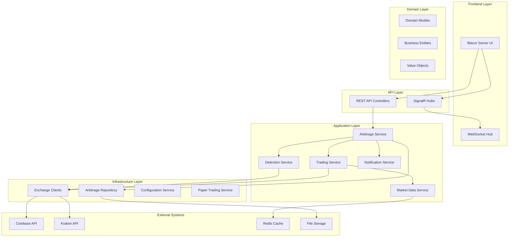
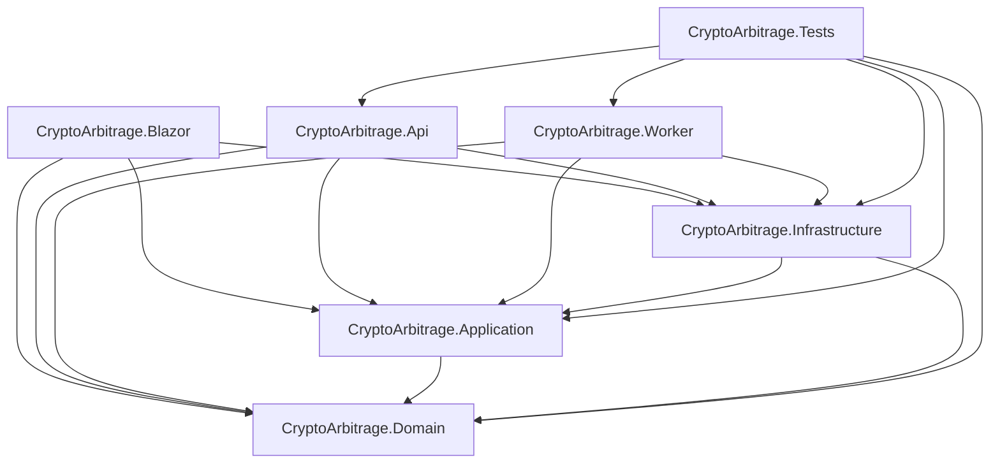

# Crypto Arbitrage System - Design Document

**Version:** 1.0  
**Date:** January 2025  
**Status:** Current Implementation Review & Future Roadmap

---

## Executive Summary

The Crypto Arbitrage System is a real-time cryptocurrency trading platform designed to detect and execute profitable price differences across multiple exchanges. The system has undergone significant architectural evolution, recently transitioning from a React-based frontend to a Blazor Server implementation, representing a fundamental shift toward a unified .NET ecosystem.

### Key Findings from Critical Review

**Strengths:**
- ✅ Clean architecture implementation with proper domain separation
- ✅ Comprehensive test coverage (Unit, Integration, E2E)
- ✅ Modern .NET 9 implementation with current best practices
- ✅ Production-ready containerization with Docker Compose
- ✅ Robust exchange abstraction supporting multiple providers (Coinbase, Kraken)
- ✅ Sophisticated risk management and paper trading capabilities

**Critical Issues Identified:**
- ⚠️ **Architectural Inconsistency**: Mixed API models and domain models causing duplication
- ⚠️ **Infrastructure Gaps**: Missing Terraform deployment automation
- ⚠️ **Documentation Debt**: API specifications directory empty, limited deployment guides
- ⚠️ **Testing Reliability**: WebSocket testing infrastructure needs improvement
- ⚠️ **Monitoring Gaps**: Limited observability and metrics collection
- ⚠️ **Blazor Property Mapping**: Known issues with model alignment between domain and UI

**Business Impact:**
- Current system can detect arbitrage opportunities but has limited production deployment automation
- Paper trading mode provides safe testing environment
- Real-time capabilities via SignalR enable responsive user experience
- Architecture supports extension to additional exchanges

---

## Project Overview

### Purpose
Automated detection and execution of cryptocurrency arbitrage opportunities across multiple exchanges with real-time monitoring, risk management, and trade execution capabilities.

### Core Capabilities
1. **Real-time Market Data Streaming** - WebSocket connections to exchange APIs
2. **Opportunity Detection** - Cross-exchange price difference analysis
3. **Risk Management** - Configurable risk profiles and safety controls
4. **Trade Execution** - Paper trading and live trading capabilities
5. **Portfolio Management** - Balance tracking and position monitoring
6. **Performance Analytics** - Comprehensive statistics and reporting

### Technology Stack
- **Backend**: C# / .NET 9, Clean Architecture
- **Frontend**: Blazor Server with MudBlazor UI components
- **Data Storage**: In-memory with file persistence (MongoDB planned)
- **Caching**: Redis for real-time data
- **Containerization**: Docker with multi-stage builds
- **Testing**: xUnit, Moq, integration test framework
- **CI/CD**: GitHub Actions

---

## Architecture Overview

### High-Level Architecture

### Current Architecture Assessment

**Adherence to Clean Architecture: ✅ Excellent**
- Clear separation of concerns across layers
- Domain layer remains independent
- Dependency injection properly implemented
- Interface segregation well applied

**Design Patterns Implementation:**
- ✅ Repository Pattern (IArbitrageRepository)
- ✅ Factory Pattern (IExchangeFactory)
- ✅ Strategy Pattern (Risk profiles, execution strategies)
- ✅ Observer Pattern (Event-driven architecture)
- ✅ CQRS concepts (Read/Write separation)

### Component Dependencies

---

## Development Roadmap

### Phase 1: Foundation Stabilization (Immediate - 2-4 weeks)

#### 1.1 Critical Bug Fixes
- [ ] **Fix Blazor Property Mapping Issues**
  - Align domain models with Blazor component expectations
  - Implement proper model validation and conversion
  - Add comprehensive integration tests for UI components

- [ ] **Resolve Model Duplication**
  - Consolidate API models with domain models
  - Implement AutoMapper or similar for model conversion
  - Update all controllers to use unified models

- [ ] **Enhance WebSocket Stability**
  - Improve connection resilience and reconnection logic
  - Add comprehensive WebSocket integration tests
  - Implement proper error handling for connection failures

#### 1.2 Infrastructure Improvements
- [ ] **Database Migration**
  - Replace file-based storage with MongoDB
  - Implement proper data migrations
  - Add database health checks

- [ ] **Enhanced Logging and Monitoring**
  - Implement structured logging with correlation IDs
  - Add performance metrics collection
  - Integrate health check endpoints

### Phase 2: Production Readiness (4-8 weeks)

#### 2.1 Deployment Automation
- [ ] **Terraform Infrastructure**
  - Create AWS infrastructure modules
  - Implement environment-specific configurations
  - Add automated deployment pipelines

- [ ] **Enhanced Container Strategy**
  - Optimize Docker images for production
  - Implement multi-stage builds with better caching
  - Add container health checks and graceful shutdown

- [ ] **Security Enhancements**
  - Implement API key management with Azure Key Vault or AWS Secrets Manager
  - Add rate limiting and DDoS protection
  - Implement audit logging for all trading activities

#### 2.2 Observability and Monitoring
- [ ] **Metrics and Alerting**
  - Implement Prometheus metrics collection
  - Create Grafana dashboards for system monitoring
  - Set up alerting for critical system failures

- [ ] **Distributed Tracing**
  - Implement OpenTelemetry tracing
  - Add correlation across service boundaries
  - Enable performance profiling

### Phase 3: Feature Enhancement (8-12 weeks)

#### 3.1 Exchange Expansion
- [ ] **Additional Exchange Integrations**
  - Binance API integration
  - KuCoin API integration
  - Implement exchange-agnostic trading logic

- [ ] **Advanced Trading Features**
  - Implement limit order support
  - Add stop-loss and take-profit mechanisms
  - Create portfolio rebalancing features

#### 3.2 Advanced Analytics
- [ ] **Machine Learning Integration**
  - Predictive opportunity scoring
  - Market volatility analysis
  - Performance optimization recommendations

- [ ] **Advanced Risk Management**
  - Dynamic risk adjustment based on market conditions
  - Portfolio-level risk metrics
  - Regulatory compliance reporting

### Phase 4: Scale and Optimization (12+ weeks)

#### 4.1 Performance Optimization
- [ ] **High-Frequency Trading Support**
  - Microsecond-level latency optimization
  - Direct market data feeds
  - Hardware-accelerated networking

- [ ] **Horizontal Scaling**
  - Microservices decomposition
  - Event-sourcing implementation
  - CQRS with separate read/write models

---

## Conclusion

The Crypto Arbitrage System demonstrates solid architectural foundations with clean separation of concerns and comprehensive testing strategies. The recent migration to Blazor Server represents a strategic consolidation toward a unified .NET ecosystem, though some technical debt remains from the transition.

### Immediate Priorities
1. **Stabilize Blazor Integration** - Resolve property mapping issues
2. **Complete Infrastructure Automation** - Implement Terraform deployment
3. **Enhance Production Monitoring** - Add comprehensive observability

### Long-term Vision
The system is well-positioned for scaling to handle high-frequency trading across multiple exchanges with advanced risk management and machine learning capabilities. The clean architecture foundation supports future enhancements while maintaining system reliability and maintainability.

### Success Metrics
- **Technical**: 99.9% uptime, <100ms arbitrage detection latency
- **Business**: Profitable trades with <2% false positive rate
- **Operational**: Zero-downtime deployments, automated incident response

---

*This document should be reviewed and updated quarterly to reflect architectural evolution and changing business requirements.* 