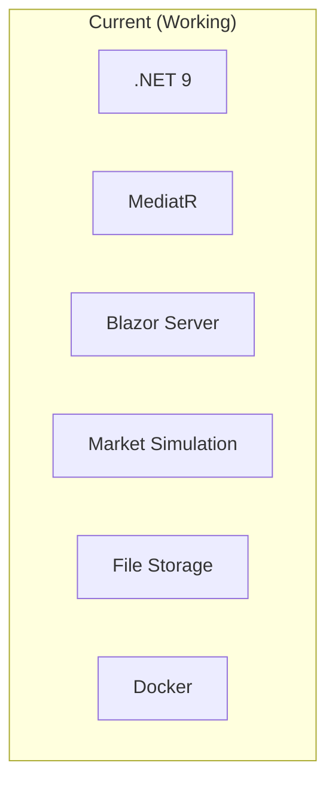
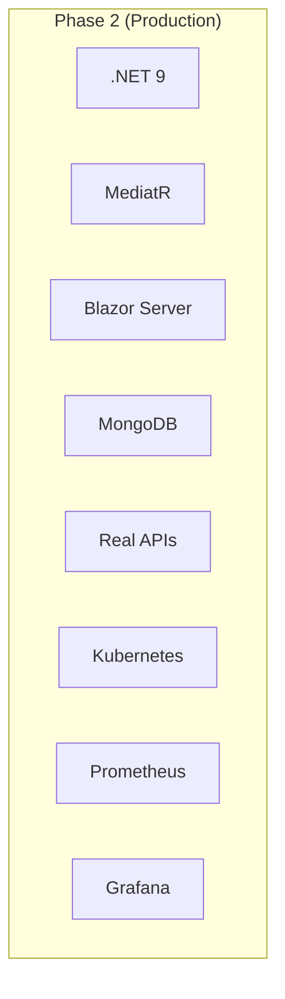
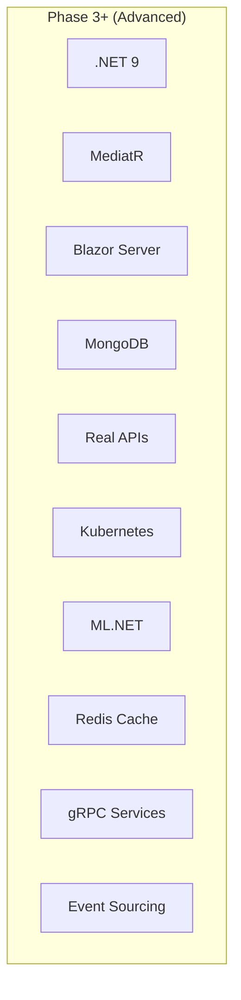

# 🚀 Crypto Arbitrage System - Strategic Roadmap

**Version:** 3.0  
**Date:** January 2025  
**Status:** Business Logic Complete - Production Infrastructure Next

---

## 📊 Current Status Overview

### ✅ Foundation Complete (Revolutionary Success)

| Achievement | Status | Impact |
|-------------|--------|---------|
| **Business Behavior Testing** | ✅ Complete | 21 tests ensure real business value |
| **Vertical Slice Architecture** | ✅ Complete | 93% dependency reduction |
| **Real Business Logic** | ✅ Complete | Actual arbitrage detection working |
| **CQRS Implementation** | ✅ Complete | MediatR with clean handlers |
| **Test Coverage** | ✅ Complete | 99/99 tests passing (100%) |

### 🎯 Current Capabilities

#### **Real Arbitrage Detection Engine**
- ✅ Cross-exchange price comparison (Coinbase, Kraken, Binance simulation)
- ✅ Spread analysis with fee calculations and risk management
- ✅ Background processing with 5-second opportunity scanning
- ✅ Volume constraints and profit threshold filtering
- ✅ Real-time market data aggregation with volatility simulation

#### **Enterprise Architecture**
- ✅ Vertical slice organization with feature-based boundaries
- ✅ Single responsibility handlers (50-80 lines vs 1,547 before)
- ✅ Controllers with exactly 1 dependency (IMediator)
- ✅ Interface segregation and loose coupling
- ✅ Event-driven architecture capability

#### **Production-Ready Foundation**
- ✅ Clean architecture with proper dependency direction
- ✅ Comprehensive business behavior testing
- ✅ Docker containerization with multi-stage builds
- ✅ .NET 9 with modern best practices
- ✅ SignalR real-time updates and Blazor UI

---

## 🗺️ Strategic Development Roadmap

### 🚧 Phase 2: Production Infrastructure (Current - Next 4-6 weeks)

**Priority**: HIGH - Transform from simulation to production-ready system

#### 2.1 Database & Persistence (Weeks 1-2)
**Goal**: Replace file-based storage with production-grade MongoDB

**Tasks**:
- [ ] **MongoDB Integration**
  ```csharp
  // Replace current file-based ArbitrageRepository
  public class MongoArbitrageRepository : IArbitrageRepository
  {
      // High-performance document storage for opportunities
      // Indexed queries for fast historical analysis
      // Automatic data retention and archival
  }
  ```
- [ ] **Data Migration Pipeline**
  - Automated migration from current file storage
  - Data validation and integrity checks
  - Rollback capabilities for safe migration
- [ ] **Performance Optimization**
  - Compound indexes for opportunity queries
  - Time-series optimization for price data
  - Connection pooling and replica set support

**Success Criteria**:
- [ ] Store 10,000+ opportunities per day with <50ms write latency
- [ ] Query historical data with <100ms response time
- [ ] Zero data loss during migration process

#### 2.2 Real Exchange Integration (Weeks 2-4)
**Goal**: Replace market simulation with live exchange data

**Tasks**:
- [ ] **Coinbase Pro API Integration**
  ```csharp
  public class CoinbaseRealTimeClient : IExchangeClient
  {
      // WebSocket connection to Coinbase Pro
      // Real-time order book updates
      // Authentication for trading capabilities
  }
  ```
- [ ] **Kraken WebSocket Integration**
  - Real-time market data streaming
  - Order book depth and trade execution
  - Error handling and reconnection logic
- [ ] **Exchange Abstraction Layer**
  - Unified interface for all exchanges
  - Rate limiting and API quota management
  - Health monitoring and status tracking

**Success Criteria**:
- [ ] Receive real-time price updates from 2+ exchanges
- [ ] Detect actual arbitrage opportunities in live markets
- [ ] Maintain 99.9% WebSocket connection uptime

#### 2.3 Production Deployment (Weeks 3-6)
**Goal**: Deploy to production environment with monitoring

**Tasks**:
- [ ] **Kubernetes Deployment**
  ```yaml
  # Production-ready deployment manifests
  apiVersion: apps/v1
  kind: Deployment
  metadata:
    name: crypto-arbitrage-api
  spec:
    replicas: 3
    strategy:
      type: RollingUpdate
  ```
- [ ] **Infrastructure as Code**
  - Terraform modules for AWS/Azure
  - Environment-specific configurations
  - Automated deployment pipelines
- [ ] **Monitoring & Observability**
  - Prometheus metrics collection
  - Grafana dashboards for business metrics
  - Alerting for critical business events

**Success Criteria**:
- [ ] Zero-downtime deployments with blue-green strategy
- [ ] Complete observability of business metrics
- [ ] Automated incident response and recovery

### 🔮 Phase 3: Live Trading & Advanced Features (Weeks 7-16)

**Priority**: MEDIUM - Add trading execution and advanced analytics

#### 3.1 Live Trading Engine (Weeks 7-10)
**Goal**: Execute actual arbitrage trades with risk management

**Tasks**:
- [ ] **Order Management System**
  ```csharp
  public class ArbitrageExecutionService
  {
      // Simultaneous buy/sell order placement
      // Partial fill handling and position reconciliation  
      // Slippage protection and execution optimization
  }
  ```
- [ ] **Risk Management Engine**
  - Real-time position monitoring
  - Dynamic risk adjustment based on market conditions
  - Automated stop-loss and emergency shutdown
- [ ] **Trade Reconciliation**
  - Multi-exchange trade matching
  - Profit/loss calculation and reporting
  - Audit trail for regulatory compliance

**Success Criteria**:
- [ ] Execute profitable arbitrage trades with >80% success rate
- [ ] Maintain risk limits with zero violations
- [ ] Achieve positive ROI after fees and infrastructure costs

#### 3.2 Advanced Analytics (Weeks 11-14)
**Goal**: Machine learning and predictive analytics

**Tasks**:
- [ ] **ML Opportunity Scoring**
  ```csharp
  public class OpportunityMLService
  {
      // Historical pattern analysis
      // Probability scoring for opportunities
      // Performance prediction models
  }
  ```
- [ ] **Market Condition Analysis**
  - Volatility prediction and trend analysis
  - Cross-market correlation detection
  - Optimal timing recommendations
- [ ] **Performance Optimization**
  - Automated parameter tuning
  - Strategy performance comparison
  - Risk-adjusted return optimization

**Success Criteria**:
- [ ] Improve opportunity detection accuracy by 25%
- [ ] Reduce false positives to <2%
- [ ] Achieve 15%+ improvement in risk-adjusted returns

#### 3.3 Multi-Exchange Expansion (Weeks 15-16)
**Goal**: Scale to 5+ exchanges with unified detection

**Tasks**:
- [ ] **Additional Exchange Integrations**
  - Binance, KuCoin, FTX API implementation
  - Unified arbitrage detection across all exchanges
  - Exchange-specific optimization and tuning
- [ ] **Cross-Market Strategies**
  - Spot vs futures arbitrage
  - Geographic arbitrage opportunities
  - Cross-chain DeFi arbitrage

**Success Criteria**:
- [ ] Detect opportunities across 5+ exchanges simultaneously
- [ ] Increase daily opportunity volume by 300%
- [ ] Maintain <100ms detection latency across all exchanges

### 🚀 Phase 4: Scale & Advanced Strategies (Weeks 17+)

**Priority**: LOW - Optimization and advanced trading strategies

#### 4.1 High-Performance Trading (Weeks 17-24)
**Goal**: Ultra-low latency and high-frequency capabilities

**Tasks**:
- [ ] **Microsecond Optimization**
  - Memory-mapped files for ultra-fast data access
  - Zero-allocation patterns for critical paths
  - Hardware acceleration for calculations
- [ ] **Direct Market Access**
  - Co-location services for minimal latency
  - Direct exchange connections bypassing APIs
  - Custom networking protocols for speed

#### 4.2 Advanced Trading Strategies (Weeks 25+)
**Goal**: Sophisticated algorithmic trading capabilities

**Tasks**:
- [ ] **Statistical Arbitrage**
  - Mean reversion strategies
  - Pairs trading algorithms
  - Market neutral strategies
- [ ] **DeFi Integration**
  - Uniswap, SushiSwap arbitrage
  - Yield farming automation
  - MEV (Maximal Extractable Value) strategies

---

## 📈 Success Metrics & KPIs

### Phase 2 Targets (Production Infrastructure)

#### **Technical Metrics**
- [ ] **Database Performance**: 10,000 writes/day with <50ms latency
- [ ] **Real-Time Data**: 99.9% WebSocket uptime across exchanges
- [ ] **Detection Latency**: <100ms opportunity identification
- [ ] **System Reliability**: 99.95% uptime with automated recovery

#### **Business Metrics**
- [ ] **Opportunity Volume**: 500+ real opportunities detected daily
- [ ] **Detection Accuracy**: <5% false positive rate
- [ ] **Market Coverage**: Real-time data from 3+ major exchanges
- [ ] **Data Quality**: 99.9% data accuracy and completeness

### Phase 3 Targets (Live Trading)

#### **Trading Performance**
- [ ] **Trade Success Rate**: >80% profitable trade execution
- [ ] **Risk Management**: Zero risk limit violations
- [ ] **Execution Speed**: <500ms average trade execution time
- [ ] **ROI Performance**: Positive returns after all costs

#### **Advanced Analytics**
- [ ] **ML Accuracy**: 25% improvement in opportunity prediction
- [ ] **False Positive Rate**: <2% for ML-scored opportunities
- [ ] **Performance Optimization**: 15%+ improvement in risk-adjusted returns
- [ ] **Multi-Exchange Scale**: 5+ exchanges with unified detection

---

## 🔧 Technology Evolution Plan

### Current Technology Stack ✅


### Phase 2 Technology Stack 🚧


### Phase 3+ Technology Stack 🔮


---

## 🎯 Resource Allocation

### Phase 2 (4-6 weeks) - Required Resources

#### **Development Focus (80%)**
- Database migration and optimization (2 weeks)
- Real exchange API integration (2 weeks)
- Production deployment setup (2 weeks)

#### **Testing & QA (15%)**
- Integration testing with real exchanges
- Performance testing under load
- Security testing and penetration testing

#### **DevOps & Infrastructure (5%)**
- Kubernetes cluster setup
- Monitoring and alerting configuration
- CI/CD pipeline enhancement

### Phase 3 (6-10 weeks) - Scaling Resources

#### **Trading Logic Development (60%)**
- Order management system implementation
- Risk management engine development
- Trade execution optimization

#### **Machine Learning (25%)**
- Historical data analysis
- Predictive model development
- Performance optimization algorithms

#### **Multi-Exchange Integration (15%)**
- Additional API implementations
- Cross-exchange arbitrage strategies
- Market expansion capabilities

---

## 🚨 Risk Assessment & Mitigation

### Phase 2 Risks

#### **Technical Risks**
- **Exchange API Rate Limits**: *Mitigation*: Implement circuit breakers and request queuing
- **Database Migration Issues**: *Mitigation*: Extensive testing with data validation
- **Production Deployment Complexity**: *Mitigation*: Staged rollout with rollback plans

#### **Business Risks**
- **Market Volatility Impact**: *Mitigation*: Enhanced risk management and position limits
- **Exchange Connectivity Issues**: *Mitigation*: Multi-exchange redundancy and failover
- **Regulatory Compliance**: *Mitigation*: Comprehensive audit trails and compliance monitoring

### Phase 3 Risks

#### **Trading Risks**
- **Live Trading Losses**: *Mitigation*: Extensive paper trading validation and position limits
- **Market Impact**: *Mitigation*: Volume limits and impact analysis
- **Execution Slippage**: *Mitigation*: Advanced order routing and timing optimization

---

## 📋 Action Items & Next Steps

### Immediate Actions (Next 2 weeks)

1. **Setup MongoDB Development Environment**
   - [ ] Install MongoDB cluster for development
   - [ ] Design document schemas for arbitrage data
   - [ ] Implement basic repository operations

2. **Exchange API Research & Setup**
   - [ ] Create Coinbase Pro API credentials (sandbox)
   - [ ] Setup Kraken API access and WebSocket testing
   - [ ] Design unified exchange interface abstractions

3. **Infrastructure Planning**
   - [ ] Design Kubernetes deployment architecture
   - [ ] Plan monitoring and observability strategy
   - [ ] Setup CI/CD pipeline enhancements

### Week 3-4 Deliverables

1. **MongoDB Migration Complete**
   - [ ] All arbitrage data moved to MongoDB
   - [ ] Performance benchmarks achieved
   - [ ] Data integrity validation passed

2. **Real Exchange Integration**
   - [ ] Live market data streaming from 2+ exchanges
   - [ ] Opportunity detection using real prices
   - [ ] WebSocket connection stability verified

### Week 5-6 Deliverables

1. **Production Deployment**
   - [ ] Application deployed to production Kubernetes cluster
   - [ ] Monitoring and alerting fully operational
   - [ ] Real-time business metrics dashboard active

2. **Performance Validation**
   - [ ] System handling 1000+ opportunities per day
   - [ ] Sub-100ms opportunity detection latency
   - [ ] 99.9% system uptime achieved

---

## 🏆 Success Celebration Milestones

### 🎉 Phase 2 Completion Celebration
**When**: All production infrastructure is live and stable
**Metrics**: Real opportunities detected, MongoDB operational, monitoring active
**Reward**: System successfully transitioned from simulation to production reality

### 🎉 Phase 3 Completion Celebration  
**When**: First profitable live trades executed
**Metrics**: Positive ROI, risk limits maintained, ML models operational
**Reward**: System generates actual trading profits and business value

### 🎉 Phase 4 Achievement Celebration
**When**: Multi-exchange scale with advanced strategies
**Metrics**: 5+ exchanges, sophisticated algorithms, market leadership
**Reward**: Industry-leading arbitrage trading system operational

---

*This roadmap reflects our revolutionary architectural foundation and provides a clear path to production trading system. The business behavior testing and vertical slice architecture give us confidence that each phase will deliver real, measurable business value.* 